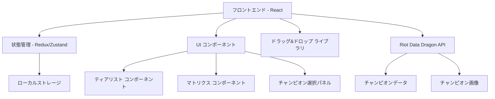

# 設計書

## 概要

League of Legendsのチャンピオンアイコンを使用したマトリクス図とティアリスト作成アプリケーションです。ユーザーはドラッグ&ドロップ操作でチャンピオンを配置し、視覚的なランキングや比較図を作成できます。

## アーキテクチャ

### システム構成



### 技術スタック

- **フロントエンド**: React 18 + TypeScript
- **状態管理**: Zustand（軽量で使いやすい）
- **スタイリング**: Tailwind CSS + CSS Modules
- **ドラッグ&ドロップ**: @dnd-kit/core
- **データソース**: Riot Games Data Dragon
- **ビルドツール**: Vite
- **データ永続化**: LocalStorage + IndexedDB

## コンポーネントとインターフェース

### 主要コンポーネント

#### 1. App コンポーネント
- アプリケーションのルートコンポーネント
- モード切り替え（ティアリスト/マトリクス）
- グローバル状態の初期化

#### 2. ChampionPanel コンポーネント
```typescript
interface ChampionPanelProps {
  champions: Champion[];
  onChampionSelect: (champion: Champion) => void;
  searchFilter: string;
  onSearchChange: (filter: string) => void;
}
```

#### 3. TierList コンポーネント
```typescript
interface TierListProps {
  tiers: Tier[];
  onTierUpdate: (tiers: Tier[]) => void;
  onChampionMove: (championId: string, fromTier: string, toTier: string) => void;
}
```

#### 4. Matrix コンポーネント
```typescript
interface MatrixProps {
  champions: PlacedChampion[];
  xAxisLabel: string;
  yAxisLabel: string;
  onChampionMove: (championId: string, x: number, y: number) => void;
  onAxisLabelChange: (axis: 'x' | 'y', label: string) => void;
}
```

#### 5. DiagramManager コンポーネント
```typescript
interface DiagramManagerProps {
  diagrams: SavedDiagram[];
  onLoad: (diagram: SavedDiagram) => void;
  onDelete: (diagramId: string) => void;
  onSave: (diagram: DiagramData) => void;
}
```

### データモデル

#### Champion インターフェース
```typescript
interface Champion {
  id: string;
  name: string;
  title: string;
  iconUrl: string;
  splashUrl: string;
  tags: string[];
}
```

#### Tier インターフェース
```typescript
interface Tier {
  id: string;
  label: string;
  color: string;
  champions: Champion[];
  order: number;
}
```

#### PlacedChampion インターフェース
```typescript
interface PlacedChampion {
  champion: Champion;
  x: number;
  y: number;
}
```

#### SavedDiagram インターフェース
```typescript
interface SavedDiagram {
  id: string;
  name: string;
  type: 'tierlist' | 'matrix';
  data: TierListData | MatrixData;
  createdAt: Date;
  updatedAt: Date;
}
```

## データモデル

### チャンピオンデータの取得

Riot Games Data Dragonから以下のエンドポイントを使用：

```typescript
// チャンピオン一覧
const CHAMPIONS_URL = 'https://ddragon.leagueoflegends.com/cdn/13.24.1/data/ja_JP/champion.json';

// チャンピオンアイコン
const ICON_URL = 'https://ddragon.leagueoflegends.com/cdn/13.24.1/img/champion/{championId}.png';

// スプラッシュアート
const SPLASH_URL = 'https://ddragon.leagueoflegends.com/cdn/img/champion/splash/{championId}_0.jpg';
```

### 状態管理構造

```typescript
interface AppState {
  // チャンピオンデータ
  champions: Champion[];
  loading: boolean;
  
  // 現在の作業
  currentMode: 'tierlist' | 'matrix';
  currentDiagram: DiagramData | null;
  
  // ティアリスト状態
  tierList: {
    tiers: Tier[];
    unplacedChampions: Champion[];
  };
  
  // マトリクス状態
  matrix: {
    champions: PlacedChampion[];
    xAxisLabel: string;
    yAxisLabel: string;
    gridSize: { width: number; height: number };
  };
  
  // 保存された図表
  savedDiagrams: SavedDiagram[];
  
  // UI状態
  ui: {
    sidebarOpen: boolean;
    searchFilter: string;
    selectedChampion: Champion | null;
  };
}
```

## エラーハンドリング

### エラータイプ

1. **ネットワークエラー**: Data Dragon APIの接続失敗
2. **データエラー**: 不正なチャンピオンデータ
3. **ストレージエラー**: ローカルストレージの容量不足
4. **バリデーションエラー**: 不正な入力データ

### エラーハンドリング戦略

```typescript
// エラー境界コンポーネント
class ErrorBoundary extends React.Component {
  // エラーキャッチとフォールバックUI表示
}

// API エラーハンドリング
const handleApiError = (error: Error) => {
  if (error.name === 'NetworkError') {
    // オフラインモードまたはキャッシュデータ使用
    return loadCachedChampions();
  }
  // エラートーストの表示
  showErrorToast(error.message);
};

// ストレージエラーハンドリング
const handleStorageError = (error: Error) => {
  if (error.name === 'QuotaExceededError') {
    // 古いデータの削除を提案
    promptDataCleanup();
  }
};
```

## テスト戦略

### テストレベル

#### 1. ユニットテスト
- 各コンポーネントの個別機能
- 状態管理ロジック
- ユーティリティ関数
- データ変換処理

#### 2. 統合テスト
- コンポーネント間の連携
- API呼び出しとデータフロー
- ドラッグ&ドロップ操作
- ローカルストレージとの連携

#### 3. E2Eテスト
- ティアリスト作成フロー
- マトリクス作成フロー
- 保存・読み込み機能
- 共有機能

### テストツール

- **ユニット/統合**: Jest + React Testing Library
- **E2E**: Playwright
- **視覚回帰**: Chromatic (Storybook)

### テストケース例

```typescript
describe('TierList Component', () => {
  test('チャンピオンをティアに移動できる', async () => {
    // テスト実装
  });
  
  test('ティアラベルを編集できる', async () => {
    // テスト実装
  });
  
  test('空のティアを削除できる', async () => {
    // テスト実装
  });
});

describe('Matrix Component', () => {
  test('チャンピオンをマトリクス上に配置できる', async () => {
    // テスト実装
  });
  
  test('軸ラベルを変更できる', async () => {
    // テスト実装
  });
});
```

### パフォーマンス考慮事項

1. **画像の遅延読み込み**: チャンピオンアイコンの効率的な読み込み
2. **仮想化**: 大量のチャンピオン表示時のパフォーマンス最適化
3. **メモ化**: 不要な再レンダリングの防止
4. **デバウンス**: 検索フィルターの最適化

### アクセシビリティ

1. **キーボードナビゲーション**: Tab/Arrow キーでの操作
2. **スクリーンリーダー対応**: ARIA ラベルとロール
3. **色覚サポート**: 色以外の視覚的手がかり
4. **フォーカス管理**: 適切なフォーカス順序

### レスポンシブデザイン

- **デスクトップ**: フル機能のドラッグ&ドロップ
- **タブレット**: タッチ最適化されたインターフェース
- **モバイル**: 簡素化されたUI、タップ操作中心